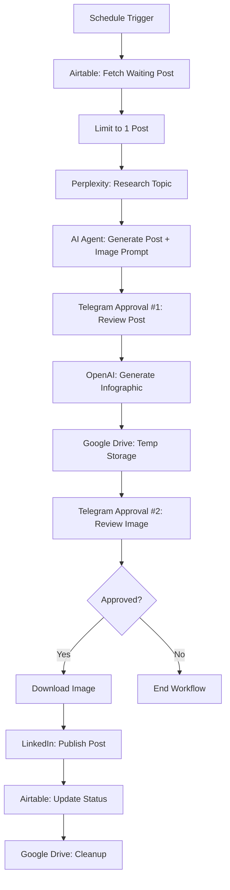

# AI-Powered LinkedIn Content Automation

[](https://n8n.io)
[](https://anthropic.com)
[](https://openai.com)
[](https://perplexity.ai)

> **Intelligent content automation system that researches topics, generates authentic LinkedIn posts with custom infographics, and publishes with human-in-the-loop approval via Telegram.**

## Workflow Architecture

This system implements an end-to-end content pipeline combining:

- **Scheduled Automation** with dual daily publishing at 11 AM & 7 PM
- **AI-Powered Research** using Perplexity for real-time information gathering
- **Intelligent Content Generation** with Claude Opus 4 for authentic post writing
- **Visual Content Creation** through OpenAI's image generation API
- **Human-in-the-Loop Validation** with dual Telegram approval checkpoints
- **Content Management** via Airtable for tracking and analytics



##  Core Capabilities

### AI Research Agent
- **Real-Time Information Gathering**: Perplexity AI for latest news and trends
- **Context-Aware Analysis**: Tech enthusiast-focused content curation
- **Comprehensive Coverage**: Multi-source information synthesis
- **Topic Relevance Filtering**: Extracting key concepts and important details

### Content Generation Agent
- **Authentic Voice**: Conversational, human-like writing style
- **Structured Formatting**: Compelling hooks and natural paragraph flow
- **No-Fluff Content**: 100-200 words of valuable insights
- **Style Consistency**: No emojis, no hashtags, professional tone
- **Engagement Optimization**: Thoughtful questions and calls-to-action

### Visual Content Agent
- **Infographic Generation**: Text-rich, information-dense designs
- **Brand Consistency**: Blue gradient color scheme with white background
- **Visual Hierarchy**: Bold titles, detailed explanations, cute graphics
- **Optimal Sizing**: 1024x1536px vertical format for LinkedIn
- **Quality Assurance**: Spelling and text accuracy validation

### Human Approval System
- **Dual Checkpoint Validation**: Post content + visual review
- **Telegram Integration**: Real-time notifications and decision interface
- **Binary Approval**: Simple approve/reject workflow
- **Timeout Protection**: Workflow pause until human response

### Content Management System
- **Airtable Database**: Centralized content tracking and status management
- **Status Pipeline**: Waiting → Generated → Posted progression
- **Post Analytics**: Direct links to published content
- **Queue Management**: Automated processing of pending topics

## 🛠️ Technology Stack

| Component | Technology | Purpose |
|-----------|------------|---------|
| **Workflow Engine** | n8n | Visual automation and orchestration |
| **AI Model (Writing)** | Claude Opus 4 | Authentic post generation |
| **AI Model (Research)** | Perplexity Sonar | Real-time information gathering |
| **AI Model (Images)** | OpenAI GPT-Image-1 | Infographic generation |
| **Database** | Airtable | Content management and tracking |
| **Messaging** | Telegram Bot API | Human approval workflow |
| **Storage** | Google Drive API | Temporary image hosting |
| **Publishing** | LinkedIn API | Post distribution |
| **Cross-Posting** | Twitter/X API | Optional multi-platform support |

##  Configuration & Setup

### Environment Requirements

```bash
# System Requirements
n8n Instance (Self-hosted or Cloud)
Airtable Account
Anthropic API Access (Claude Opus 4)
Perplexity API Key
OpenAI API Key
Telegram Bot Token
Google Drive API Credentials
LinkedIn API OAuth2
```

### Airtable Schema

Create table "Daily Linkedin Posts":

| Field | Type | Options |
|-------|------|---------|
| Title | Single line text | Required |
| Link | URL | Optional reference |
| Context | Long text | Additional info |
| Content | Long text | Auto-populated |
| Status | Single select | Waiting, Generated, Posted |
| Linkedin Post Link | URL | Published post URL |

### Required API Keys

```bash
# AI & Research
ANTHROPIC_API_KEY=sk-ant-xxxxx
PERPLEXITY_API_KEY=pplx-xxxxx
OPENAI_API_KEY=sk-xxxxx

# Services
AIRTABLE_TOKEN=patxxxxx
TELEGRAM_BOT_TOKEN=123456:ABCxxx
TELEGRAM_CHAT_ID=123456789

# Google Services
GOOGLE_DRIVE_FOLDER_ID=1a2b3c4d5e
LINKEDIN_PERSON_ID=urn:li:person:xxxxx
```

##  Getting Started

### 1. Clone & Import Workflow

```bash
# Download workflow
git clone https://github.com/yourusername/linkedin-automation.git
cd linkedin-automation

# Import to n8n
# 1. Open n8n interface
# 2. Click "Workflows" → "Import from File"
# 3. Select linkedin_automation_workflow.json
```

### 2. Configure Credentials

Add credentials in n8n:

```bash
# Add in n8n Settings → Credentials
- Airtable API Token
- Anthropic API
- Perplexity API (HTTP Header Auth)
- OpenAI API
- Telegram Bot API
- Google Drive OAuth2
- LinkedIn OAuth2
```

### 3. Update Workflow IDs

Replace placeholders in workflow nodes:

```bash
YOUR_AIRTABLE_BASE_ID        # From Airtable URL
YOUR_TABLE_ID                # From table URL
YOUR_TELEGRAM_CHAT_ID        # From @userinfobot
YOUR_GOOGLE_DRIVE_FOLDER_ID  # From Drive folder URL
YOUR_LINKEDIN_PERSON_ID      # From LinkedIn node after auth
```

### 4. Activate Workflow

```bash
# In n8n workflow editor
1. Click "Active" toggle (top right)
2. Verify schedule: 11 AM & 7 PM daily
3. Test with manual execution
```

##  Usage Guide

### Adding Content to Queue

```bash
# In Airtable "Daily Linkedin Posts" table
1. Add new row
2. Set Title: "Your topic here"
3. Set Link: "https://reference-url.com" (optional)
4. Set Status: "Waiting"
5. Save
```

### Approval Workflow

#### Step 1: Post Content Approval
```
Telegram notification:
"Is this post looks good??"

[Post content preview]

[Approve] [Reject]
```

#### Step 2: Image Approval
```
Telegram notification:
"Check the image:"

[View File] (Google Drive link)

[Approve] [Reject]
```

### Manual Execution

```bash
# In n8n workflow
1. Click "Execute Workflow" button
2. Monitor execution in real-time
3. Approve in Telegram when prompted
4. Check Airtable for status update
```

##  Workflow Nodes Breakdown

### Core Processing Nodes

| Node | Type | Function |
|------|------|----------|
| Schedule Trigger | Cron | Runs at 11 AM & 7 PM daily |
| Airtable | Data Source | Fetches posts with status "Waiting" |
| Limit | Filter | Processes one post per execution |
| Perplexity Search | HTTP Request | Researches topic information |
| AI Agent | LangChain Agent | Generates post + image prompt |
| Telegram2 | Approval Bot | Post content review |
| HTTP Request | OpenAI API | Generates infographic |
| Convert to File | Data Transform | Base64 to binary conversion |
| Google Drive | Temp Storage | Image hosting for review |
| Telegram1 | Approval Bot | Image review |
| If | Conditional | Checks approval status |
| Download image | Google Drive | Retrieves approved image |
| Post to LinkedIn | LinkedIn API | Publishes content |
| Airtable1 | Data Update | Marks as "Posted" with link |
| Delete file | Cleanup | Removes temp image |

## Multi-Platform Publishing

The workflow includes X/Twitter integration:
- Enable X node after LinkedIn posting
- Configure Twitter OAuth2 credentials
- Adjust post format for Twitter (280 char limit)
- Consider image dimensions for Twitter cards

## Content Variations

Modify AI Agent prompt for different styles:
- **Technical Deep-Dives**: Add more detail and jargon
- **Casual Updates**: Shorten length, increase personality
- **Industry News**: Focus on analysis and commentary
- **Educational Content**: Add more examples and frameworks

##  Acknowledgments

- **n8n** for powerful workflow automation
- **Anthropic** for Claude Opus 4 language model
- **OpenAI** for DALL-E image generation
- **Perplexity AI** for research capabilities
